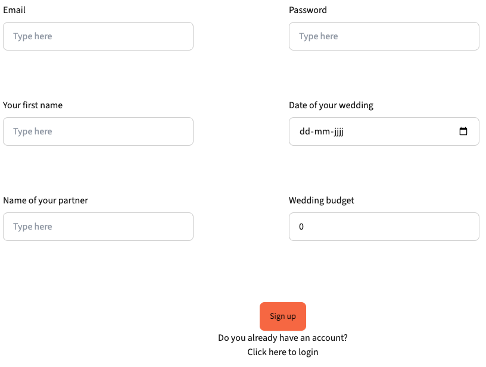
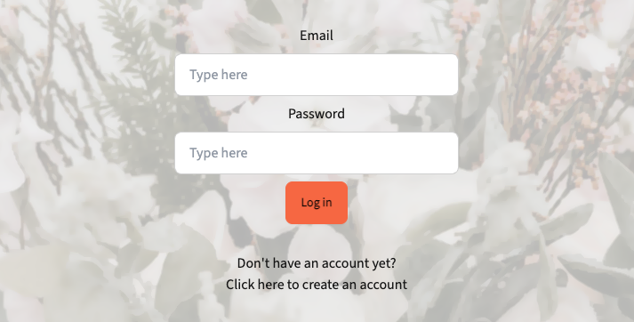
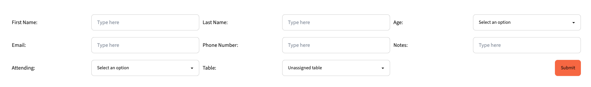
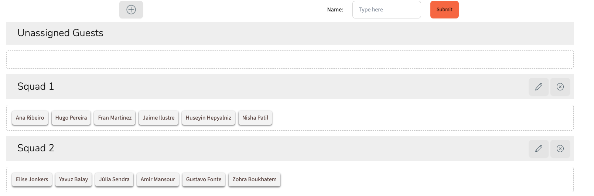

# Project 3 | I do Planner :cherry_blossom:

## Introduction
I do Planner is developed for project 3 of the Web Development Ironhack Bootcamp (cohort October 2023, remote). The project is down based on pair programming and it's performed by Júlia Sendra and Elise Jonkers. I do Planner is developed by using the MERN stack. 

This repo belongs to the frontend of the app. In order to check out the repo of the backend, click on the following: https://github.com/your-wedding-planner/i-do-planner-backend

## Setup
In order to run the application on your computer, you should follow these steps:
- Fork this repo
- Clone this repo
- After opening the code, create a folder called '.env' and paste `VITE_API_URL=http://localhost:5005`
- Run the following in the terminal:
1. npm install
2. npm i react-router-dom —save
3. npm i react-router-dom
4. npm install -D tailwindcss
5. npm install -D tailwindcss postcss autoprefixer
6. npm i daisyui react-daisyui
7. npm i nodemon --save-dev
8. npm i @hello-pangea/dnd
9. npm install react-hot-toast
10. npm run dev -- --port 5174

## App overview and user instructions
#### Icons
The app is provided with some icons/buttons which share the same functionality through the whole app:

 The user can open an add form

 The user can open an edit form

 The user can delete an item

### Confirmation window and toast
Every time the user wants to create, edit or delete an item, there will be a confirmation window. The user can confirm and the procedure will continue and a toast of the operation is showed. If the user cancels, the operation is cancelled. 

### Header 
The header is always shown on every page and displays the I do Planner log. The user will be redirected to the HomePage when clicking on the logo.

### NavBar
When the user is not logged in, the NavBar will display the options for the Login and Signup. When the user is logged in, the NavBarr will display the options to go to the HomePage, GuestList, VendorList, BudgetCalculator and SeatingPlanner. It will also give the user the option to logout.

### Signup
This gives the user the possibility to create an account. The users needs to provide an email, password, first name, date of the wedding, first name of the partner and the budget of the wedding. All fields are required to create an account. You can only create one account with your email. The password must containt at least 1 uppercase letter, 1 lowercase, a number and should be at least be 6 characters long. If the user already has an account, the user can click on 'Click here to login' to go to the login page.

### Login
This gives the user the possibility to login. The user needs to provide the email and correct password. If the wrong credentials are provided, a message will display this message. If the user doesn't have an account yet, the user can click on 'Click here to create an account' to go to the signup page.

### HomePage
I do Planner is providing you with an overview of the wedding of your dreams that you are planning. All the data created by the user will only be visible when logged in on the specific account. On the HomePage the user will see the following:
- Information about the wedding. It displays the name of the user, the name of the partner, the date of the wedding and a countdown in days, hours, minutes and seconds.
- Information about the remaining budget (see BudgetCalculator), displayed in the amount in EUR and %.
- The icon of GuestList. It will redirect the user to the GuestList when clicked.
- The icon of VendorList. It will redirect the user to the VendorList when clicked.
- The icon of BudgetCalculator. It will redirect the user to the BudgetCalculator when clicked.
- The icon of SeatingPlanner. It will redirect the user to the SeatingPlanner when clicked.

### GuestList
This page will provide the user with a table of the guestlist showing the name of the guest, status of invitation and the table assigned to the guest. The user can use the searchbar to search a guest by first or last name. The user can click on the 'Sort by Status' button to sort the guests by the status of the invitation. On the top left the page the user can click on the add button to open the form to add a new guest. The user has to fill in the fields of this form (required: first name, last name, age, attending) and must click 'submit'. The created guest will be added to the table. 

### GuestDetails
The user can see more details of the guest by clicking on the row in the table. The GuestDetails wil display an image and the details according to the form (see above). 
- Edit icon: it redirects the user to a form with all the information of the guest prefilled. The user can edit information of the guest as wanted and click 'save'. Afterwards the user will be redirected to the GuestDetails.
- Delete icon: the user can delete this specific guest. 

### VendorList 
This page will provide the user with a table of the vendorlisst showing the name of the vendor, description and the type of service. The user can use the searchbar to search a vendor by name. The user can click on the 'Sort by Category' button to sort the vendors by category. On the top left the page the user can click on the add button to open the form to add a new vendor. The user has to fill in the fields of this form (required: name, location, type of service) and must click 'submit'. The created vendor will be added to the table. 

### VendorDetails
The user can see more details of the vendor by clicking on the row in the table. The VendorDetails wil display an image (matching the type of service) and the details according to the form (see above). 
- Edit icon: it redirects the user to a form with all the information of the vendor prefilled. The user can edit information of the vendor as wanted and click 'save'. Afterwards the user will be redirected to the VendorDetails.
- Delete icon: the user can delete this specific vendor. 

### BudgetCalculator
This page will provide the user with an overview of the budget and cost items. At the top left the budget of the wedding is shown as filled in at the signup. At the top right the total of the cost items is provided. At the top center the remaining budget is provided in EUR and %. Below it displays a table with the cost items showing the name, cost, description and type of cost. The user can use the searchbar to search a costitem by name. At the same time the user can select the type of cost. The total cost (top right) will be changed for the current table overview. The user can also sort the cost items by low-high or high-low by clicking on the corresponding buttons. On the left above the searchbar the user can click on the add button to open the form to add a new cost item. The user has to fill in the fields of this form (required: name, cost, description and type of service) and must click 'submit'. The created cost item will be added to the table. On each row there is an edit and delete icon for that specific cost item.
- Edit icon: it redirects the user to a form with all the information of the cost item prefilled. The user can edit information of the cost item as wanted and click 'save'. Afterwards the user will be redirected to the BudgetCalculator.
- Delete icon: the user can delete this specific cost item. 

### SeatingPlanner
This page will provide the user with an overview of the tables. The user can create tables and drag the guests to the table as wanted and plan the table seating as wanted. If the user is not assigned to a table (when guest is created) the default will be 'Unassigned Guests'. The user can create a new table by clicking on the add icon at the top center of the page. The user needs to fill in the name of the table and click 'submit' in order to create a new table. The new table will display under the 'Unassigned Guests'. The user can now drag guests as wanted to the created tables. The user can open the edit form by clicking on the edit icon of the specific table. An edit form will open at the bottom of the page. The user can delete a table by clicking on the delete icon. If a table is deleted, the assigned guests will be automatically moved to the 'Unassigned Guests'. 

### Footer & LandingPage
The footer provides the user with links to the LandingPage. This page is provided with information about 'Wedding Organization, 'About us' and 'Contact' and gives a possibility to redirect to the signup page. The 'Contact Us' provides linkes to Linkedin and GitHub. 

## Demo
Visit the following URL to use the app: https://i-do-planner.netlify.app

